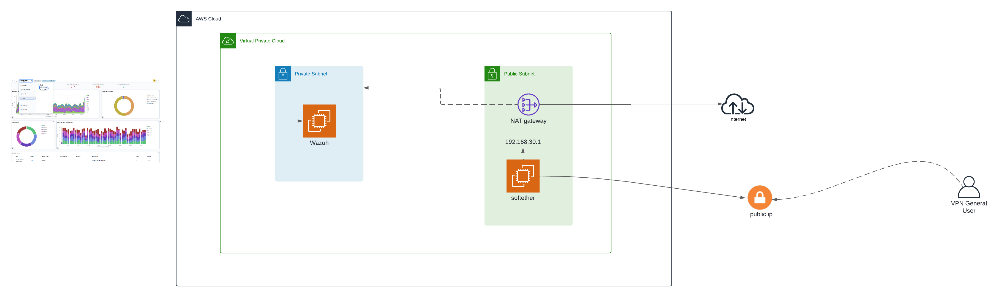
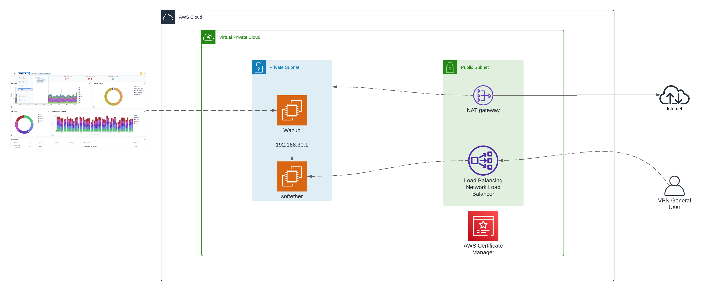

# Deploy SoftEther and Wazuh using CloudFormation on AWS

This project focuses on deploying SoftEther VPN and Wazuh, an open-source security monitoring platform, on Amazon Web Services (AWS) using CloudFormation (CF) to monitor and block malicious IPs. This is achieved through an Infrastructure as Code (IaC) approach, leveraging AWS CloudFormation stacks to provision all necessary resources.

## How It Works

The deployment requires a VPC with a minimum of three availability zones. The CloudFormation templates for this setup are available in this repository.

The CloudFormation stack will install and configure the Wazuh client on the SoftEther instance. This client will then collect application logs and send them to the central Wazuh server. Upon receiving the logs, Wazuh will display the information on a pre-configured dashboard imported from this repository.

## Infrastructure Deployment with AWS CloudFormation

To begin, the core infrastructure needs to be implemented. AWS CloudFormation is utilized for this purpose, transforming templates into essential AWS resources. These resources include:

* VPC (Virtual Private Cloud)
* Private and Public Subnets
* EC2 Instances
* Security Groups
* IAM Roles
* Network Interfaces
* Elastic IPs

The repository link for the CloudFormation templates is: [https://github.com/cloudkeynet/softether_wazuh.git](https://github.com/cloudkeynet/softether_wazuh.git)

### Step 1: Deploying the VPC Template

The initial step involves uploading the `VPC.yml` template. This template defines your VPC and the subnets necessary for subsequent connections. It includes two public and two private subnets, from which one of each type will be used for the deployment.

### Step 2: Deploying the SoftEther and Wazuh Template using public instance ip

Next, deploy the `SoftEther_internal.yml` template. This template contains the resources required to create the SoftEther VPN instance, which acts as a secure gateway to the Wazuh instance.

This template requires specific configurations:

* Wazuh and SoftEther Passwords
* Private and Public Subnet IDs
* VPC ID
* Environment Name
* Encrypted Message

The resources created by this template include a security group, a network interface, an elastic IP, and the Wazuh instance hosting the security platform. The IP address to access Wazuh will be displayed in the "Outputs" section of the CloudFormation Stack.


### Step 2: Deploying the SoftEther and Wazuh Template using NLB

If you want to use an NLB and an SSL, deploy the `SoftEther_external.yml` template. This template contains the resources required to create the SoftEther VPN instance and the NLB, which acts as a secure gateway to the Wazuh instance.

This template requires specific configurations:

* Wazuh and SoftEther Passwords
* NLB
* VPC ID
* Environment Name
* Encrypted Message
* Certification manager "This needs to be created before deploying the CF"

The resources created by this template include a security group, an NLB, and the Wazuh instance hosting the security platform. The IP address to access Wazuh will be displayed in the "Outputs" section of the CloudFormation Stack.

You will need to add the NLB record as a CNAME to the domain to use SSL.


### Step 3: Connect to SoftEther VPN Server

Open the SoftEther VPN Server Manager program. Connect to the VPN using the Elastic IP found in the "Outputs" section of the "SoftEther_internal" CloudFormation stack.

### Step 4: Create VPN Users and Connect via Client

After connecting to the server, create the necessary user accounts within the SoftEther VPN Server Manager. Subsequently, use the SoftEther VPN Client Manager to connect using the new user credentials and the same Elastic IP. Once connected, you will be able to access the graphical interface of Wazuh.

### Step 5: Log in to Wazuh

Access the Wazuh interface and log in using the default user "admin" and the password you assigned during the CloudFormation stack creation.

### Step 6: Active Response Configuration on Wazuh EC2

To configure active response on the Wazuh instance, follow these steps:

1.  **Connect to the AWS EC2 Instance**:
    * Open the AWS console and navigate to the EC2 service.
    * Locate your Wazuh instance.
    * Select the instance and click “Connect”.
    * Choose the “Session Manager” option and connect to the instance.
2.  **Gain Superuser Privileges**:
    * Once connected, execute `sudo su` to obtain superuser permissions.
3.  **Modify the Wazuh Configuration File**:
    * Open the `ossec.conf` configuration file with a text editor (e.g., `vi` or `nano`) at `/var/ossec/etc/ossec.conf`.
    * Scroll to the `<active-response>` section and add the following code block:
        ```xml
        <ossec_config>
          <active-response>
            <disabled>no</disabled>
            <command>netsh</command>
            <location>local</location>
            <rules_id>100100</rules_id>
            <timeout>60</timeout>
          </active-response>
        </ossec_config>
        ```
    * Save changes and close the file.
4.  **Restart the Wazuh Manager Service**:
    * Apply changes by restarting the Wazuh Manager service with `sudo systemctl restart wazuh-manager`.

### Step 7: Import Dashboard Visualizations

From the top-right corner menu, navigate to "Dashboards Management" and select "Dashboards Management" again from the dropdown. Within this section, click on "Saved Objects" and then import the `Visualizations.ndjson` file. This file contains all the pre-configured graphs and visualizations for the "Explore-Dashboard" section.

## Conclusion

This project provides a detailed guide for deploying Wazuh on AWS using an Infrastructure as Code approach with CloudFormation, ensuring scalable and reproducible security monitoring. The integration of SoftEther VPN secures access to the Wazuh instance. Key benefits of this approach include automated and reproducible deployments, an enhanced security posture, scalability, operational efficiency, and cost-effectiveness. This blueprint enables organizations to establish a resilient and proactive security framework on AWS, protecting cloud assets and maintaining business continuity.
